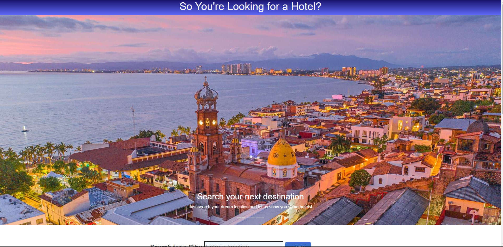
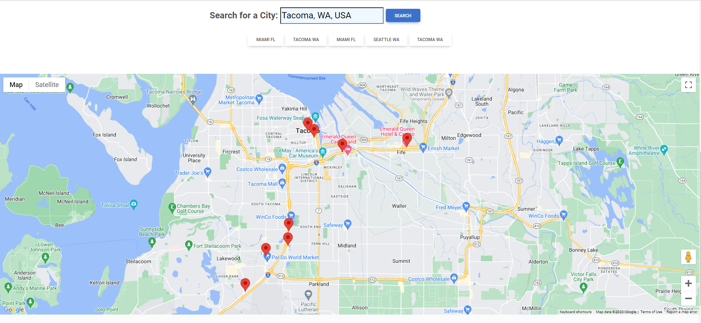

Project 1 Description
We were tasked with creating a front-end application that can be showcased to future employers. As a group we met various requirements. We used MDbootstrap as our CSS framework, deployed to GitHub, made it interactive, used two different server-side APIs (Google Maps and Priceline), used client-side storage, and made sure the page looked clean and ran smoothly.

We based our project off the following User Story: As a travel enthusiast, I want to be able to search a future travel destination and find nearby hotels to stay at

User flow: user arrives at page, images and text greet them with purpose of the application for a hotel finder while travelling. User can then input a travel city of choice and click the search button. After searching, user will see a map pop up using google maps api showing physical location of the nearby hotels. In addition to physical locations of the hotel, the app stores user searchs using client-side storage. 

https://github.com/SamanthaJoy13/so_youre_looking_for_a_hotel
https://samanthajoy13.github.io/so_youre_looking_for_a_hotel/ 
